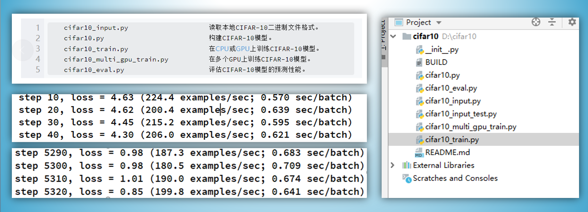
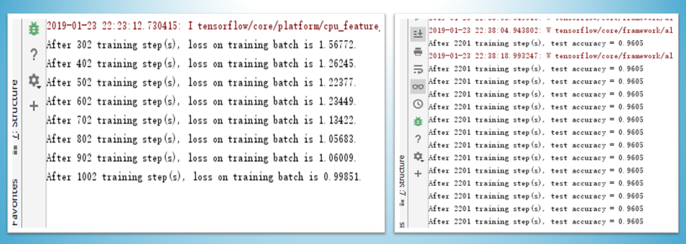

# CNN_tutorials

```txt
linear fitting.py: 生成服从一维正态分布的随机数（离散值），使用最小二乘法进行曲线拟合，并梯度下降法求取极值。 对最小二乘法和梯度下降法的一个无调用实现
projectCNN.py    : CNN卷积神经网络分类cifar10的TensorFlow实现与详解
keras-CNN-ipy    ：用keras搭建简易CNN分类fashionminist数据集的一个实现
```



